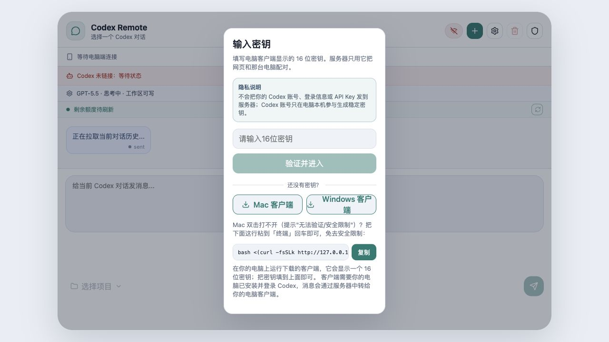
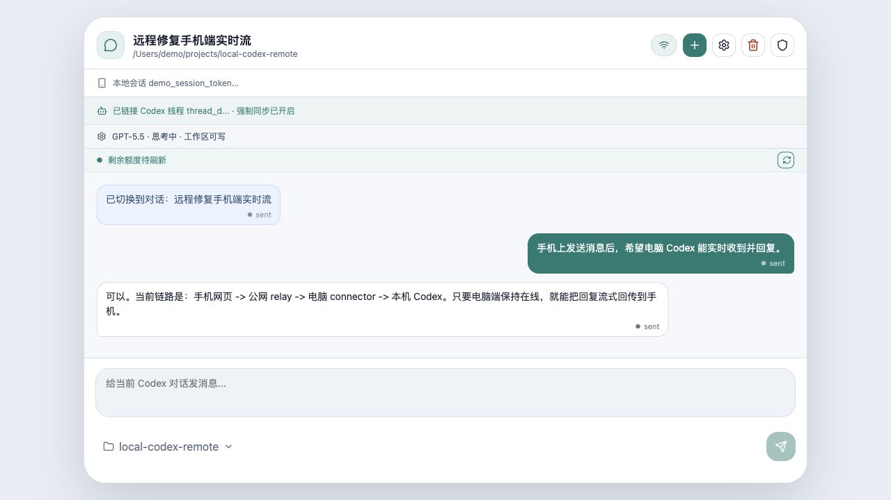
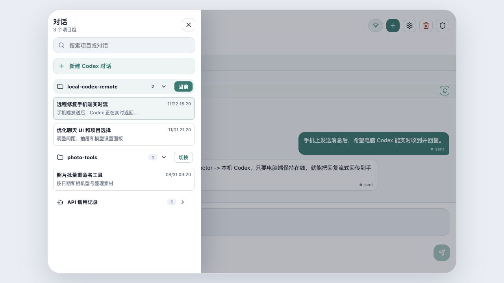
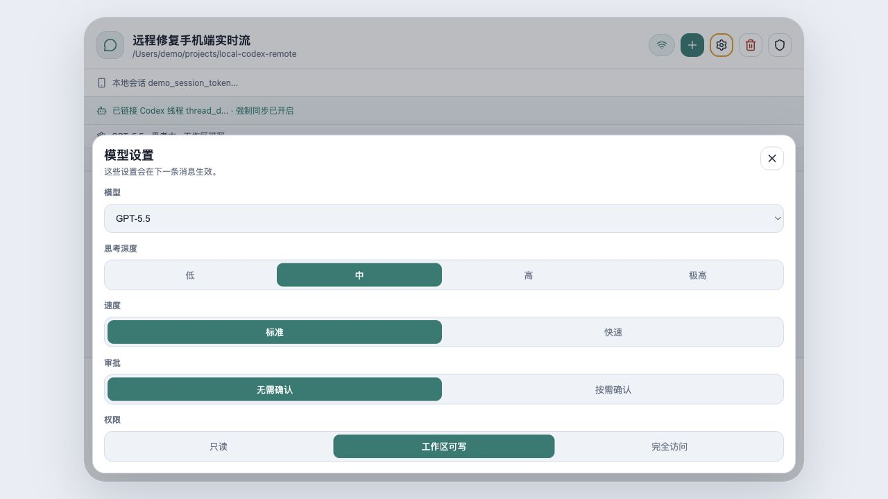

# Local Codex Remote

手机网页远程控制本机 Codex 的开源实验项目。它不是把 Codex 跑在云端，而是让云服务器只做中转：手机网页发送消息到 relay，relay 转给你电脑上的 connector，connector 再把消息交给本机 Codex。

> English summary: A self-hosted relay plus local desktop connector for using your local Codex session from a mobile web UI. The cloud server only relays messages; Codex stays on your own computer.

## 项目展示

| 密钥配对 | 手机聊天 |
| --- | --- |
|  |  |

| 项目与对话选择 | 模型与权限设置 |
| --- | --- |
|  |  |

## 它解决什么问题

当你电脑上已经打开并登录 Codex，但人不在电脑前时，可以用手机浏览器进入自己的网页，输入电脑端显示的 16 位密钥，然后继续和本机 Codex 对话。

链路如下：

```text
手机浏览器
  -> 公网 relay 服务器
  -> 你的电脑 connector
  -> 本机 Codex / Codex App Server
```

重要原则：

- 服务器不需要你的 Codex 账号。
- 服务器不需要 OpenAI API Key。
- 16 位密钥只用于把网页和电脑 connector 配对。
- Codex 账号只在电脑本机参与生成稳定密钥，不作为网页登录信息上传。

## 功能

- 手机网页聊天界面
- Mac / Windows 本机 connector
- 16 位密钥配对
- Codex 对话列表、历史记录、项目组选择
- 模型、思考深度、速度、权限模式选择
- 剩余额度读取
- 管理员面板、登录记录、安全日志
- 失败次数限制、密钥黑名单、IP 白名单
- 本机 Codex 桌面强制同步模式

## 小白使用说明

### 1. 准备服务器

准备一台 Linux 云服务器，开放 SSH、HTTP、HTTPS。建议先用测试服务器验证，不要一开始就暴露给很多人。

### 2. 部署 relay 和网页

```bash
export REMOTE_HOST=YOUR_SERVER_IP_OR_DOMAIN
export REMOTE_USER=admin
export SSH_KEY="$HOME/.ssh/your-deploy-key"
export PROJECT_DIR=/opt/local-codex
export PUBLIC_BASE_URL=https://YOUR_SERVER_IP_OR_DOMAIN

bash docs/deploy/deploy-stack.sh
```

部署完成后访问：

```text
https://YOUR_SERVER_IP_OR_DOMAIN
```

### 3. 在电脑上启动 connector

网页登录页会提供 Mac / Windows 客户端下载。也可以本地安装：

```bash
bash tools/install-local-connector.sh
```

connector 启动后会显示一个 16 位密钥。

macOS 强制同步需要给 Terminal / node / osascript 辅助功能权限：

```text
系统设置 -> 隐私与安全性 -> 辅助功能
```

### 4. 手机网页输入密钥

手机打开你的网页地址，输入电脑端显示的 16 位密钥。验证通过后，手机网页就会和那台电脑绑定。

### 5. 选择 Codex 对话并发送消息

进入网页后可以：

- 选择已有 Codex 对话
- 新建 Codex 对话
- 切换项目组
- 调整模型、思考深度、速度、权限
- 查看剩余额度
- 删除当前对话

## 本地开发

需要 Node.js 18+。

```bash
npm install
npm run dev
```

默认会启动：

- 后端：`http://localhost:8787`
- 前端：`http://localhost:5173`

## 目录

```text
apps/mobile-web   手机网页前端
apps/relay        公网中转服务
apps/connector    本机电脑端连接器
apps/server       本地开发/旧版一体服务
packages/shared   共享类型与工具
docs/deploy       部署与安全脚本
tools             本机安装脚本
```

## 安全建议

- 不要把管理员 KEY 写进源码。
- 使用 `CODEX_ADMIN_KEY_FILE` 注入管理员密钥。
- 生产环境建议开启 HTTPS。
- 只开放必要端口。
- 给管理入口加失败次数限制。
- 给自己的密钥加入白名单，避免误封。
- 不要公开自己的 16 位密钥、管理员 KEY、服务器 SSH 密钥。

示例配置见：

- `docs/deploy/security.env.example`
- `docs/deploy/connector.env.example`

## 开源注意

本仓库不包含：

- 真实服务器 IP
- 真实管理员密钥
- 真实 16 位密钥
- SSH 私钥
- `.env`
- 个人收款二维码
- 个人自动化脚本

如果你 fork 后要部署，请使用自己的服务器、域名和密钥。

## English Quick Start

Install dependencies and run locally:

```bash
npm install
npm run dev
```

Deploy to a Linux relay server:

```bash
export REMOTE_HOST=YOUR_SERVER_IP_OR_DOMAIN
export REMOTE_USER=admin
export SSH_KEY="$HOME/.ssh/your-deploy-key"
export PROJECT_DIR=/opt/local-codex
export PUBLIC_BASE_URL=https://YOUR_SERVER_IP_OR_DOMAIN

bash docs/deploy/deploy-stack.sh
```

Run the local connector on the computer where Codex is installed, then enter the connector's 16-character pairing code in the mobile web UI.

The relay does not run Codex. Codex remains on the user's own computer through the local connector.

## License

MIT
